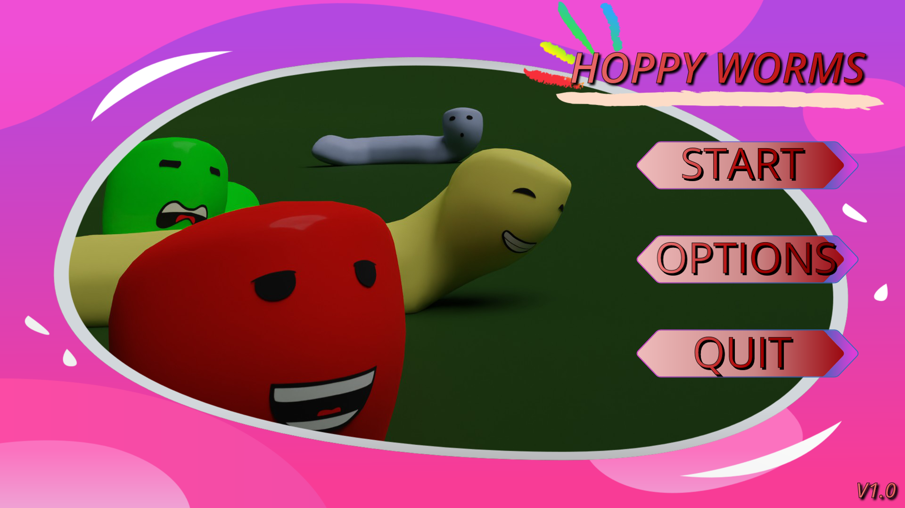
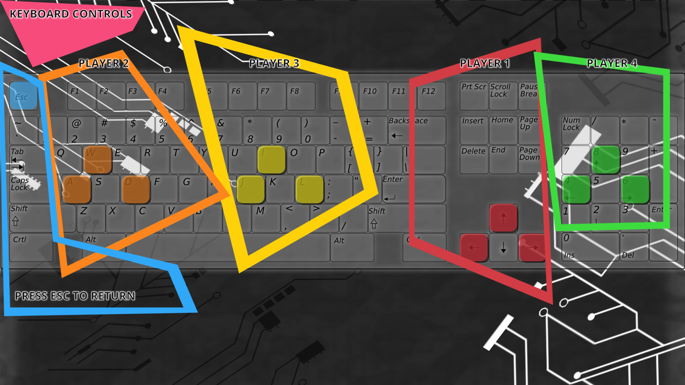
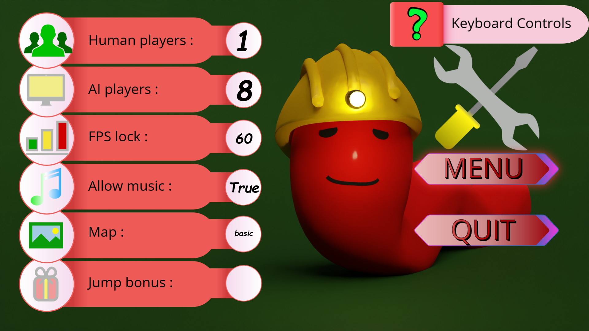
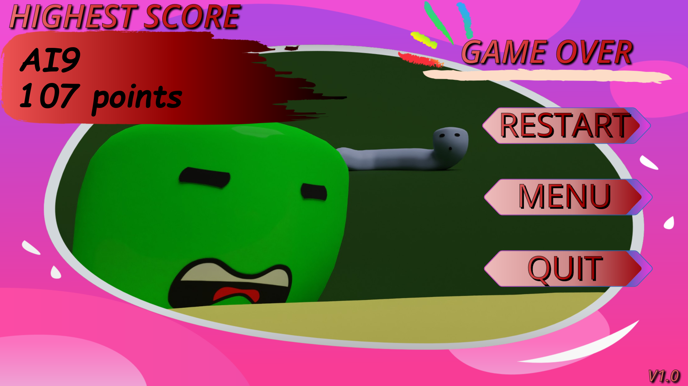

# Hopy
Game for 4 human players with possibility to play against up to 8 bots. Originally created for my niece :)


<!-- ABOUT THE PROJECT -->
## About The Project

<!-- PROJECT LOGO -->
<br />
<div align="center">
  <a href="https://github.com/serstuk93/Hopy">
    
  </a>
</div>


<p align="right">(<a href="#top">back to top</a>)</p>

<!-- TABLE OF CONTENTS -->
<details>
  <summary>Table of Contents</summary>
  <ol>
    <li>
      <a href="#about-the-project">About The Project</a>
      <ul>
        <li><a href="#built-with">Built With</a></li>
      </ul>
    </li>
    <li>
      <a href="#getting-started">Getting Started</a>
      <ul>
        <li><a href="#prerequisites">Prerequisites</a></li>
        <li><a href="#installation">Installation</a></li>
      </ul>
    </li>
    <li><a href="#usage">Usage</a></li>
    <li><a href="#planned_features">Planned Features</a></li>
    <li><a href="#license">License</a></li>
    <li><a href="#contact">Contact</a></li>
    <li><a href="#acknowledgments">Acknowledgments</a></li>
  </ol>
</details>


### Built With

* [Python](https://www.python.org/)


<p align="right">(<a href="#top">back to top</a>)</p>

<!-- GETTING STARTED -->
## Getting Started

To get a local copy up and run the game you need to have python 3.7(or newer) and necessary packages installed. 


### Prerequisites

Pygame package is necessary to run this game. Install it via IDE or in terminal with help of "pip". 

* pygame
  ```sh
  pip install pygame
  ```

### Installation

1. Create Venv in your IDE

2. Activate your Venv

3. Clone reporitory
   ```sh
   git clone  https://github.com/serstuk93/Hopy.git
   ```
4. Open repository in as your project in your IDE or if you are using terminal use command 
    ```js
   cd <your location of repository on disk> 
   ```
   
5. Install pygame package with ```pip install -r requirements.txt``` or simply install pygame package with ```pip install pygame``` 
 
6. Launch the game 
   ```js
   python hopy.py
   ```

<p align="right">(<a href="#top">back to top</a>)</p>


<!-- USAGE EXAMPLES -->
## Usage

You can skip intro or start game directly to the options menu by changing "game_status" definition from default "welcome_intro" to other string from list of strings called "game_state". 

<br />
Main menu 

<br />
<div align="left">
  <a href="https://github.com/serstuk93/Hopy">
    
  </a>
</div>
<br />
Gameplay example

<br />
<div align="left">
  <a href="https://github.com/serstuk93/Hopy">
    
  </a>
</div>
<br />
Keyboard controls 

<br />
<div align="left">
  <a href="https://github.com/serstuk93/Hopy">
    
  </a>
</div>
<br />
Options with possibility to change background/map and pick number of players

<br />
<div align="left">
  <a href="https://github.com/serstuk93/Hopy">
    
  </a>
</div>
<br />
Basic endscreen with most successful player

<br />
<div align="left">
  <a href="https://github.com/serstuk93/Hopy">
    
  </a>
</div>


<p align="right">(<a href="#top">back to top</a>)</p>


<!-- Planned_Features -->
## Planned Features

- [X] Up to 4 human players
- [X] Up to 8 AIs
- [X] Jump effect
- [ ] Jump bonus
- [ ] Multithreading 
- [X] AI optimalization and improvement of position awarness
    - [X] Prediction improvements
- [ ] Learning AI mechanism
- [ ] AI difficulties
- [ ] Multiple resolution support
- [ ] Localization


<p align="right">(<a href="#top">back to top</a>)</p>


<!-- LICENSE -->
## License

Distributed under the MIT License. See `LICENSE.txt` for more information.

<p align="right">(<a href="#top">back to top</a>)</p>


<!-- CONTACT -->
## Contact

Radoslav S.: radoslav993@gmail.com


<p align="right">(<a href="#top">back to top</a>)</p>


<!-- ACKNOWLEDGMENTS -->
## Acknowledgments

* This game is still in alpha state
* Please dont hesitate to create a new issue when something goes wrong :) 
* Licences of music and images of maps are issued by Pixabay GmbH c/o Lacore Rechtsanwälte LLP for free, if you want to use those assets in your fork, please claim your copy of licence by creating account at those online services.

<p align="right">(<a href="#top">back to top</a>)</p>


<!-- MARKDOWN LINKS & IMAGES -->
<!-- https://www.markdownguide.org/basic-syntax/#reference-style-links -->
[contributors-shield]: https://img.shields.io/github/contributors/github_username/repo_name.svg?style=for-the-badge
[contributors-url]: https://github.com/github_username/repo_name/graphs/contributors
[forks-shield]: https://img.shields.io/github/forks/github_username/repo_name.svg?style=for-the-badge
[forks-url]: https://github.com/github_username/repo_name/network/members
[stars-shield]: https://img.shields.io/github/stars/github_username/repo_name.svg?style=for-the-badge
[stars-url]: https://github.com/github_username/repo_name/stargazers
[issues-shield]: https://img.shields.io/github/issues/github_username/repo_name.svg?style=for-the-badge
[issues-url]: https://github.com/github_username/repo_name/issues
[license-shield]: https://img.shields.io/github/license/github_username/repo_name.svg?style=for-the-badge
[license-url]: https://github.com/github_username/repo_name/blob/master/LICENSE.txt
[linkedin-shield]: https://img.shields.io/badge/-LinkedIn-black.svg?style=for-the-badge&logo=linkedin&colorB=555
[linkedin-url]: https://linkedin.com/in/linkedin_username
[product-screenshot]: images/screenshot.png
